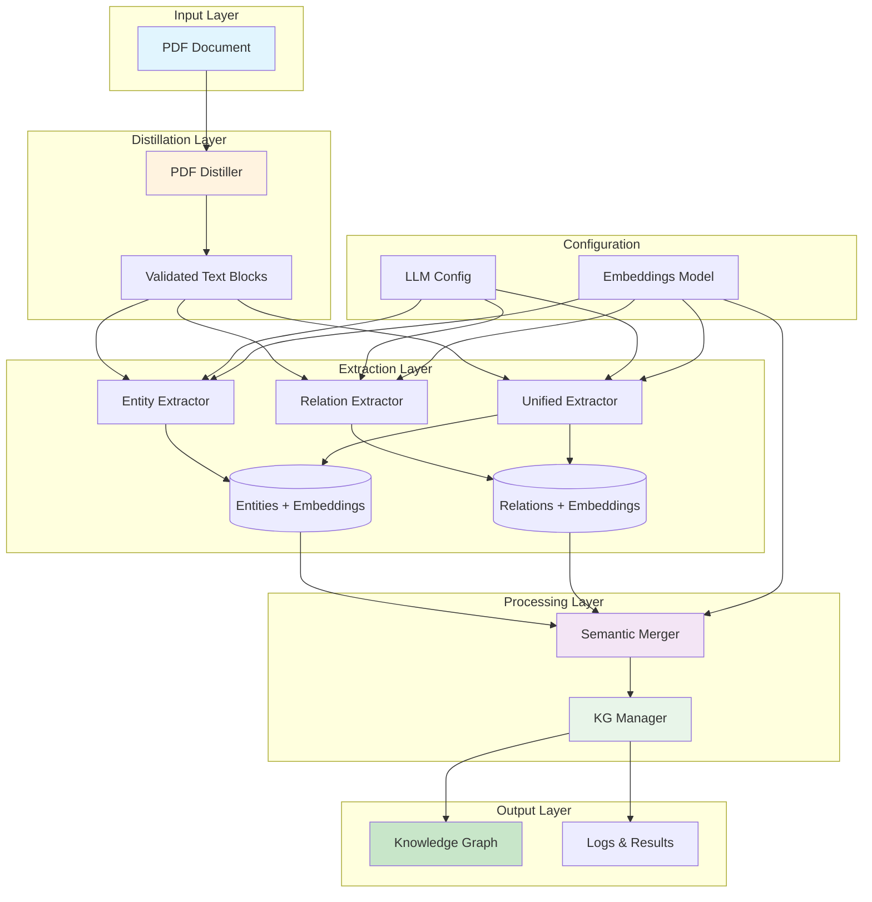
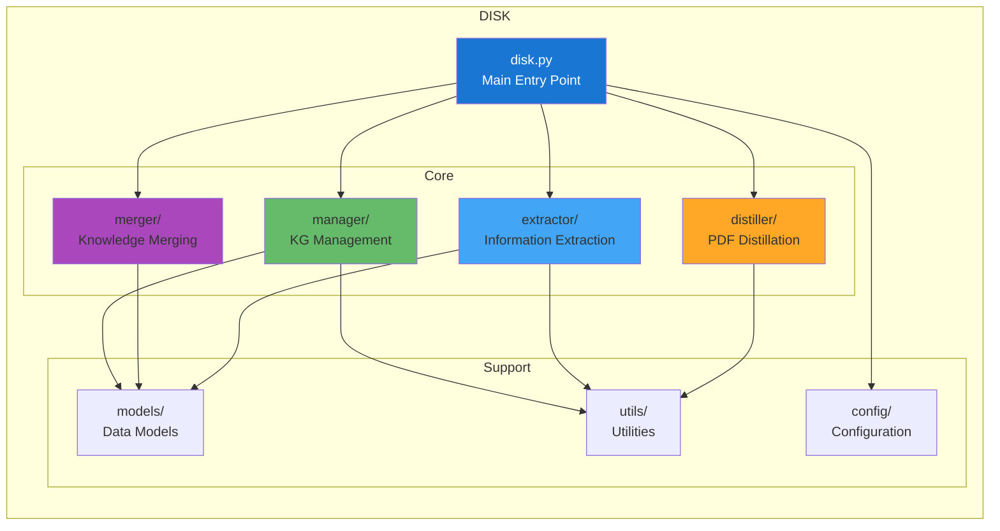
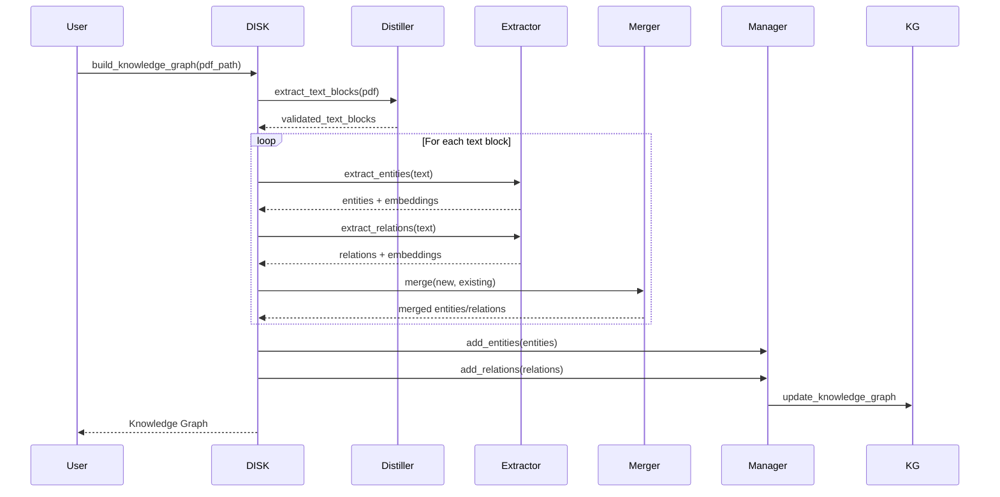

# DISK
Domain Incremental conStruction of Knowledge graph.

## Overview

DISK is a comprehensive toolkit for extracting knowledge from PDF documents and building domain knowledge graphs through text distillation, entity/relation extraction, and semantic merging. The system provides a modular pipeline that transforms unstructured PDF documents into structured knowledge representations.

### Core Capabilities

- **Document Distillation**: Extract and validate text blocks, tables, and images from PDF documents
- **Entity Extraction**: Identify and extract domain entities with semantic embeddings
- **Relation Extraction**: Discover relationships between entities with contextual understanding
- **Knowledge Graph Construction**: Build and manage knowledge graphs with incremental updates
- **Semantic Merging**: Intelligently merge similar entities and relations using cosine similarity

## Architecture

### System Architecture



### Module Structure



### Data Flow



## Modules

### Distillation Module (distiller/)

- **pdf_distiller**
    - extract **paragraphs** with intelligent validation
    - extract **tables**(to be improved)
    - extract **imgs**(to be improved)
    - filter out low-quality text blocks (references, incomplete sentences)

### Extraction Module (extractor/)

- **entities_extractor**
    - extract domain entities with labels and descriptions
    - generate semantic embeddings for each entity

- **relations_extractor**
    - extract relationships between entities
    - generate semantic embeddings for each relation

- **extractor** (unified)
    - extract both entities and relations in a single pass
    - optimized for incremental processing

### Processing Modules

- **extract entities**
- **extract relationships**
- **semantic merging** (merger/)
    - merge similar entities using cosine similarity
    - update relations after entity merging
    - configurable threshold (default: 0.8)
- **construct knowledge graph** (manager/)
    - incremental knowledge graph construction
    - deduplication of entities and relations

## Config

**env**
```bash
# use uv to manage the environment
uv venv
uv sync
```

**LLM Configuration**

1. Copy the example configuration file:
```bash
cp config.example.toml config.toml
```

2. Edit `config.toml` to set your API keys and preferences:

```toml
[disk]
llm = "openai"  # Choose provider: openai, qwen, ollama, etc.

[disk.embeddings]
model = "text-embedding-3-small"
api_key = "ai-..."
api_url = "https://api.openai.com/v1"

[model.openai]
api_url = "https://api.openai.com/v1"
api_key = "ai-..."
model = "gpt-4o"

[model.other]
api_url = "https://api.otherprovider.com/v1"
api_key = "sk-..."
model = "gpt-4o"
```

3. Supported providers:
   - **OpenAI** (default)
   - **Qwen** (DashScope)
   - **Kimi** (Moonshot)
   - **Ollama** (Local)
   - **All other providers** that support OpenAI-compatible APIs

You can switch providers by changing the `llm` field in `[disk]` or using the runtime `switch()` function.


## Contrast

### merge
- itext2kg
```
[INFO] Wohoo! Entity was matched --- [poor deep semantic understanding in traditional ie models:Limitation] --merged--> [cosine similarity ignores deep semantic differences:Limitation]
```